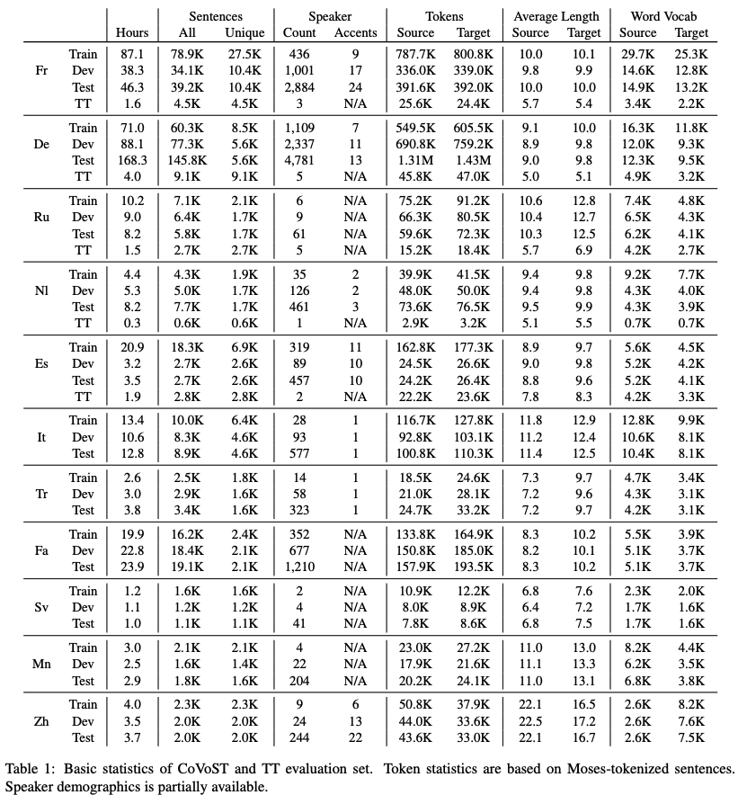

CoVoST: A Diverse Multilingual Speech-To-Text Translation Corpus
======
[](http://creativecommons.org/publicdomain/zero/1.0/)
<a href="https://colab.research.google.com/drive/11GK7k7G1CG1qHbdA9Pz1RtQ3vlCkuohV">
    
</a>


[End-to-end speech translation](https://github.com/kahne/SpeechTransProgress) (E2E ST) has recently witnessed an increased
interest given its system simplicity, lower inference latency and less compounding errors compared to cascaded
one (speech recognition + machine translation). E2E ST model training, however, is often hampered by the lack of parallel
data. Thus, we created [CoVoST](https://arxiv.org/abs/2002.01320), a large & diverse multilingual speech-to-text
translation corpus based on [Common Voice](https://arxiv.org/abs/1912.06670) (2019-06-12 release). It includes speeches
in 11 languages (French, German, Dutch, Russian, Spanish, Italian, Turkish, Persian, Swedish, Mongolian and Chinese),
their transcripts and English translations. We also provide an additional out-of-domain evaluation set
from [Tatoeba](https://tatoeba.org/eng) for 5 languages (French, German, Dutch, Russian and Spanish) into English.

Please check out [our paper](https://arxiv.org/abs/2002.01320) for more details and
the [VizSeq example](https://colab.research.google.com/drive/11GK7k7G1CG1qHbdA9Pz1RtQ3vlCkuohV) for exploring CoVoST data.

<p align="center"></p>

## What's New
- __2020-02-27__: [Example](https://colab.research.google.com/drive/11GK7k7G1CG1qHbdA9Pz1RtQ3vlCkuohV) added for
exploring CoVoST data with [VizSeq](https://github.com/facebookresearch/vizseq) 
- __2020-02-13__: [Paper](https://arxiv.org/abs/2002.01320) accepted to [LREC 2020](https://lrec2020.lrec-conf.org/en/) (Oral)
- __2020-02-07__: CoVoST released

## Getting Data

### CoVoST
1. Download the 2019-06-12 release of Common Voice (NOT the latest 2019-12-10 one from the web page) for speeches and transcripts:
    - [French (fr)](https://voice-prod-bundler-ee1969a6ce8178826482b88e843c335139bd3fb4.s3.amazonaws.com/cv-corpus-3/fr.tar.gz)
    - [German (de)](https://voice-prod-bundler-ee1969a6ce8178826482b88e843c335139bd3fb4.s3.amazonaws.com/cv-corpus-3/de.tar.gz)
    - [Dutch (nl)](https://voice-prod-bundler-ee1969a6ce8178826482b88e843c335139bd3fb4.s3.amazonaws.com/cv-corpus-3/nl.tar.gz)
    - [Russian (ru)](https://voice-prod-bundler-ee1969a6ce8178826482b88e843c335139bd3fb4.s3.amazonaws.com/cv-corpus-3/ru.tar.gz)
    - [Spanish (es)](https://voice-prod-bundler-ee1969a6ce8178826482b88e843c335139bd3fb4.s3.amazonaws.com/cv-corpus-3/es.tar.gz)
    - [Italian (it)](https://voice-prod-bundler-ee1969a6ce8178826482b88e843c335139bd3fb4.s3.amazonaws.com/cv-corpus-3/it.tar.gz)
    - [Turkish (tr)](https://voice-prod-bundler-ee1969a6ce8178826482b88e843c335139bd3fb4.s3.amazonaws.com/cv-corpus-3/tr.tar.gz)
    - [Persian (fa)](https://voice-prod-bundler-ee1969a6ce8178826482b88e843c335139bd3fb4.s3.amazonaws.com/cv-corpus-3/fa.tar.gz)
    - [Swedish (sv-SE)](https://voice-prod-bundler-ee1969a6ce8178826482b88e843c335139bd3fb4.s3.amazonaws.com/cv-corpus-3/sv-SE.tar.gz)
    - [Mongolian (mn)](https://voice-prod-bundler-ee1969a6ce8178826482b88e843c335139bd3fb4.s3.amazonaws.com/cv-corpus-3/mn.tar.gz)
    - [Chinese (zh-CN)](https://voice-prod-bundler-ee1969a6ce8178826482b88e843c335139bd3fb4.s3.amazonaws.com/cv-corpus-3/zh-CN.tar.gz)

2. [Download translations](https://dl.fbaipublicfiles.com/covost/covost.zip) for all the 11 languages,
where `validated.<lang>_en.en` are matched with the transcripts in `validated.tsv`.

### Tatoeba Evaluation Data
1. [Download transcripts and translations](https://dl.fbaipublicfiles.com/covost/tatoeba.zip) and extract files
to `data/tt/*`.

2. Download speech data:
```bash
python get_tt_speech.py --root <mp3 download root (default to data/tt/mp3)>
```

## Exploring Data
[VizSeq Example](https://colab.research.google.com/drive/11GK7k7G1CG1qHbdA9Pz1RtQ3vlCkuohV)
<a href="https://colab.research.google.com/drive/11GK7k7G1CG1qHbdA9Pz1RtQ3vlCkuohV">
    
</a>

## License
|  | License |
| ------------- |:-------------:|
| CoVoST data | [CC0](https://creativecommons.org/share-your-work/public-domain/cc0/) |
| Tatoeba sentences | [CC BY 2.0 FR](https://creativecommons.org/licenses/by/2.0/fr/) |
| Tatoeba speeches | Various CC licenses (please check out `data/tt/tatoeba_s2t.<lang>_en.<lang>_lic`) |
| Anything else | [CC BY-NC 4.0](https://github.com/facebookresearch/covost/blob/master/LICENSE) |

## Citation
Please cite as
```
@inproceedings{wang-etal-2020-covost,
    title = "{C}o{V}o{ST}: A Diverse Multilingual Speech-To-Text Translation Corpus",
    author = "Wang, Changhan  and
      Pino, Juan  and
      Wu, Anne  and
      Gu, Jiatao",
    booktitle = "Proceedings of The 12th Language Resources and Evaluation Conference",
    month = may,
    year = "2020",
    address = "Marseille, France",
    publisher = "European Language Resources Association",
    url = "https://www.aclweb.org/anthology/2020.lrec-1.517",
    pages = "4197--4203",
    abstract = "Spoken language translation has recently witnessed a resurgence in popularity, thanks to the development of end-to-end models and the creation of new corpora, such as Augmented LibriSpeech and MuST-C. Existing datasets involve language pairs with English as a source language, involve very specific domains or are low resource. We introduce CoVoST, a multilingual speech-to-text translation corpus from 11 languages into English, diversified with over 11,000 speakers and over 60 accents. We describe the dataset creation methodology and provide empirical evidence of the quality of the data. We also provide initial benchmarks, including, to our knowledge, the first end-to-end many-to-one multilingual models for spoken language translation. CoVoST is released under CC0 license and free to use. We also provide additional evaluation data derived from Tatoeba under CC licenses.",
    language = "English",
    ISBN = "979-10-95546-34-4",
}
```

## Contact
Changhan Wang ([changhan@fb.com](mailto:changhan@fb.com)),
Juan Miguel Pino ([juancarabina@fb.com](mailto:juancarabina@fb.com)),
Jiatao Gu ([jgu@fb.com](mailto:jgu@fb.com))
