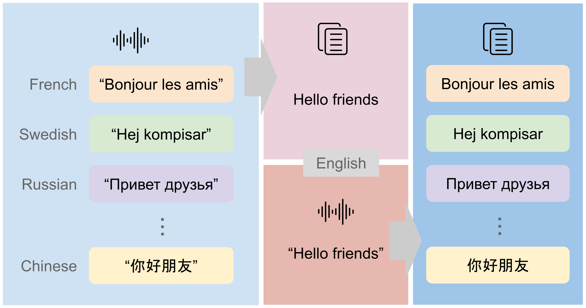
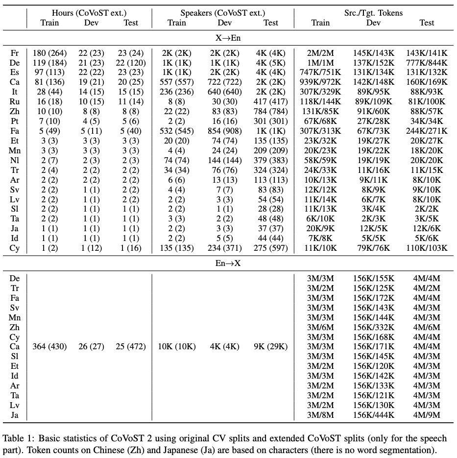

CoVoST: A Large-Scale Multilingual Speech-To-Text Translation Corpus
======
[](http://creativecommons.org/publicdomain/zero/1.0/)
<a href="https://colab.research.google.com/drive/11GK7k7G1CG1qHbdA9Pz1RtQ3vlCkuohV">
    
</a>


[End-to-end speech-to-text translation](https://github.com/kahne/SpeechTransProgress) (ST) has recently witnessed an
increased interest given its system simplicity, lower inference latency and less compounding errors compared to cascaded
ST (i.e. speech recognition + machine translation). End-to-end ST model training, however, is often hampered by the
lack of parallel data. Thus, we created [CoVoST](https://arxiv.org/abs/2002.01320), a large-scale multilingual ST corpus
based on [Common Voice](https://arxiv.org/abs/1912.06670), to foster ST research with the largest ever open dataset.
Its latest version covers translations from English into 15 languages---Arabic, Catalan, Welsh, German, Estonian, 
Persian, Indonesian, Japanese, Latvian, Mongolian, Slovenian, Swedish, Tamil, Turkish, Chinese---and from 21 languages 
into English, including the 15 target languages as well as Spanish, French, Italian, Dutch, Portuguese, Russian. It has 
total 2,880 hours of speech and is diversified with 78K speakers.

<p align="center"></p>

Please check out our papers ([CoVoST 1](https://arxiv.org/abs/2002.01320), [CoVoST 2](https://arxiv.org/pdf/2007.10310)) 
for more details and the [VizSeq example](https://colab.research.google.com/drive/11GK7k7G1CG1qHbdA9Pz1RtQ3vlCkuohV) for
exploring CoVoST data.

<p align="center"></p>

We also provide an additional out-of-domain evaluation set
from [Tatoeba](https://tatoeba.org/eng) for 5 languages (French, German, Dutch, Russian and Spanish) into English.

## What's New
- __2021-01-06__: Data splitting script added. 
  [Fairseq S2T example](https://github.com/pytorch/fairseq/tree/master/examples/speech_to_text) added for model training.
- __2020-07-21__: CoVoST 2 released ([arXiv paper](https://arxiv.org/pdf/2007.10310)) with 25 new translation directions.
- __2020-02-27__: [Colab example](https://colab.research.google.com/drive/11GK7k7G1CG1qHbdA9Pz1RtQ3vlCkuohV) added for
exploring CoVoST data with [VizSeq](https://github.com/facebookresearch/vizseq).
- __2020-02-13__: [Paper](https://arxiv.org/abs/2002.01320) accepted to LREC 2020.
- __2020-02-07__: CoVoST released.

## Getting Data

<details><summary>Language code</summary><p>

| Lang | Code |
|---|---|
| English | en |
| French | fr |
| German | de |
| Spanish | es |
| Catalan | ca |
| Italian | it |
| Russian | ru |
| Chinese | zh-CN | 
| Portuguese | pt |
| Persian | fa |
| Estonian | et |
| Mongolian | mn |
| Dutch | nl |
| Turkish | tr |
| Arabic | ar |
| Swedish | sv-SE |
| Latvian | lv |
| Slovenian | sl |
| Tamil | ta |
| Japanese | ja |
| Indonesian | id |
| Welsh | cy |
</p></details>

### CoVoST 2
1. Download [Common Voice audio clips and transcripts](https://commonvoice.mozilla.org/en/datasets) (version 4).
2. Download CoVoST 2 translations (`covost_v2.<src_lang_code>_<tgt_lang_code>.tsv`, which matches the rows in 
   `validated.tsv` from Common Voice):
- X into English: [French](https://dl.fbaipublicfiles.com/covost/covost_v2.fr_en.tsv.tar.gz),
  [German](https://dl.fbaipublicfiles.com/covost/covost_v2.de_en.tsv.tar.gz),
  [Spanish](https://dl.fbaipublicfiles.com/covost/covost_v2.es_en.tsv.tar.gz),
  [Catalan](https://dl.fbaipublicfiles.com/covost/covost_v2.ca_en.tsv.tar.gz),
  [Italian](https://dl.fbaipublicfiles.com/covost/covost_v2.it_en.tsv.tar.gz),
  [Russian](https://dl.fbaipublicfiles.com/covost/covost_v2.ru_en.tsv.tar.gz),
  [Chinese](https://dl.fbaipublicfiles.com/covost/covost_v2.zh-CN_en.tsv.tar.gz),
  [Portuguese](https://dl.fbaipublicfiles.com/covost/covost_v2.pt_en.tsv.tar.gz),
  [Persian](https://dl.fbaipublicfiles.com/covost/covost_v2.fa_en.tsv.tar.gz),
  [Estonian](https://dl.fbaipublicfiles.com/covost/covost_v2.et_en.tsv.tar.gz),
  [Mongolian](https://dl.fbaipublicfiles.com/covost/covost_v2.mn_en.tsv.tar.gz),
  [Dutch](https://dl.fbaipublicfiles.com/covost/covost_v2.nl_en.tsv.tar.gz),
  [Turkish](https://dl.fbaipublicfiles.com/covost/covost_v2.tr_en.tsv.tar.gz),
  [Arabic](https://dl.fbaipublicfiles.com/covost/covost_v2.ar_en.tsv.tar.gz),
  [Swedish](https://dl.fbaipublicfiles.com/covost/covost_v2.sv-SE_en.tsv.tar.gz),
  [Latvian](https://dl.fbaipublicfiles.com/covost/covost_v2.lv_en.tsv.tar.gz),
  [Slovenian](https://dl.fbaipublicfiles.com/covost/covost_v2.sl_en.tsv.tar.gz),
  [Tamil](https://dl.fbaipublicfiles.com/covost/covost_v2.ta_en.tsv.tar.gz),
  [Japanese](https://dl.fbaipublicfiles.com/covost/covost_v2.ja_en.tsv.tar.gz),
  [Indonesian](https://dl.fbaipublicfiles.com/covost/covost_v2.id_en.tsv.tar.gz),
  [Welsh](https://dl.fbaipublicfiles.com/covost/covost_v2.cy_en.tsv.tar.gz)
- English into X: [German](https://dl.fbaipublicfiles.com/covost/covost_v2.en_de.tsv.tar.gz), 
  [Catalan](https://dl.fbaipublicfiles.com/covost/covost_v2.en_ca.tsv.tar.gz),
  [Chinese](https://dl.fbaipublicfiles.com/covost/covost_v2.en_zh-CN.tsv.tar.gz),
  [Persian](https://dl.fbaipublicfiles.com/covost/covost_v2.en_fa.tsv.tar.gz),
  [Estonian](https://dl.fbaipublicfiles.com/covost/covost_v2.en_et.tsv.tar.gz),
  [Mongolian](https://dl.fbaipublicfiles.com/covost/covost_v2.en_mn.tsv.tar.gz),
  [Turkish](https://dl.fbaipublicfiles.com/covost/covost_v2.en_tr.tsv.tar.gz),
  [Arabic](https://dl.fbaipublicfiles.com/covost/covost_v2.en_ar.tsv.tar.gz),
  [Swedish](https://dl.fbaipublicfiles.com/covost/covost_v2.en_sv-SE.tsv.tar.gz),
  [Latvian](https://dl.fbaipublicfiles.com/covost/covost_v2.en_lv.tsv.tar.gz),
  [Slovenian](https://dl.fbaipublicfiles.com/covost/covost_v2.en_sl.tsv.tar.gz),
  [Tamil](https://dl.fbaipublicfiles.com/covost/covost_v2.en_ta.tsv.tar.gz),
  [Japanese](https://dl.fbaipublicfiles.com/covost/covost_v2.en_ja.tsv.tar.gz),
  [Indonesian](https://dl.fbaipublicfiles.com/covost/covost_v2.en_id.tsv.tar.gz),
  [Welsh](https://dl.fbaipublicfiles.com/covost/covost_v2.en_cy.tsv.tar.gz)
3. Get data splits: we adopt the standard Common Voice development/test splits and an extended Common Voice train split 
   to improve data utilization (see also Section 2.2 in [our paper](https://arxiv.org/pdf/2007.10310.pdf)). Use the 
   following script to generate the data splits:
    ```bash
    python get_covost_splits.py \
      --version 2 --src-lang <src_lang_code> --tgt-lang <tgt_lang_code> \
      --root <root path to the translation TSV and output TSVs> \
      --cv-tsv <path to validated.tsv>
    ```
   You should get 3 TSV files (`covost_v2.<src_lang_code>_<tgt_lang_code>.<split>.tsv`) for `train`, `dev` and 
   `test` splits, respectively. Each of them has 4 columns: `path` (audio filename), `sentence` (transcript), 
   `translation` and `client_id` (speaker ID).

### CoVoST 1
1. Download [Common Voice audio clips and transcripts](https://commonvoice.mozilla.org/en/datasets) (version 3).

2. Download CoVoST translations (`covost.<src_lang_code>_<tgt_lang_code>.tsv`, which matches the rows in 
   `validated.tsv` from Common Voice): 
   - X into English: [French](https://dl.fbaipublicfiles.com/covost/covost.fr_en.tsv.tar.gz),
   [German](https://dl.fbaipublicfiles.com/covost/covost.de_en.tsv.tar.gz),
   [Dutch](https://dl.fbaipublicfiles.com/covost/covost.nl_en.tsv.tar.gz),
   [Russian](https://dl.fbaipublicfiles.com/covost/covost.ru_en.tsv.tar.gz),
   [Spanish](https://dl.fbaipublicfiles.com/covost/covost.es_en.tsv.tar.gz),
   [Italian](https://dl.fbaipublicfiles.com/covost/covost.it_en.tsv.tar.gz),
   [Turkish](https://dl.fbaipublicfiles.com/covost/covost.tr_en.tsv.tar.gz),
   [Persian](https://dl.fbaipublicfiles.com/covost/covost.fa_en.tsv.tar.gz),
   [Swedish](https://dl.fbaipublicfiles.com/covost/covost.sv-SE_en.tsv.tar.gz),
   [Mongolian](https://dl.fbaipublicfiles.com/covost/covost.mn_en.tsv.tar.gz),
   [Chinese](https://dl.fbaipublicfiles.com/covost/covost.zh-CN_en.tsv.tar.gz)

3. Get data splits: we use extended Common Voice splits to improve data utilization. Use the following script to 
   generate the data splits:
   ```bash
    python get_covost_splits.py \
      --version 1 --src-lang <src_lang_code> --tgt-lang <tgt_lang_code> \
      --root <root path to the translation TSV and output TSVs> \
      --cv-tsv <path to validated.tsv>
    ```
   You should get 3 TSV files (`covost.<src_lang_code>_<tgt_lang_code>.<split>.tsv`) for `train`, `dev` and `test` 
   splits, respectively. Each of them has 4 columns: `path` (audio filename), `sentence` (transcript), `translation` and 
   `client_id` (speaker ID).

### Tatoeba Evaluation Data
1. Download [transcripts and translations](https://dl.fbaipublicfiles.com/covost/tatoeba.zip) and extract files
to `data/tt/*`.

2. Download speech data:
```bash
python get_tt_speech.py \
  --root <mp3 download root (default to data/tt/mp3)>
```

## Exploring Data
[VizSeq Example](https://colab.research.google.com/drive/11GK7k7G1CG1qHbdA9Pz1RtQ3vlCkuohV)
<a href="https://colab.research.google.com/drive/11GK7k7G1CG1qHbdA9Pz1RtQ3vlCkuohV">
    
</a>

## Model Training
We provide [fairseq S2T example](https://github.com/pytorch/fairseq/tree/master/examples/speech_to_text) for speech 
recognition/translation model training.

## License
|  | License |
| ------------- |:-------------:|
| CoVoST data | [CC0](https://creativecommons.org/share-your-work/public-domain/cc0/) |
| Tatoeba sentences | [CC BY 2.0 FR](https://creativecommons.org/licenses/by/2.0/fr/) |
| Tatoeba speeches | Various CC licenses (please check out the "audio_license" column in `data/tt/tatoeba20191004.s2t.<lang>_en.tsv`) |
| Anything else | [CC BY-NC 4.0](https://github.com/facebookresearch/covost/blob/master/LICENSE) |

## Citation
Please cite as (CoVoST 2)
```
@misc{wang2020covost,
    title={CoVoST 2: A Massively Multilingual Speech-to-Text Translation Corpus},
    author={Changhan Wang and Anne Wu and Juan Pino},
    year={2020},
    eprint={2007.10310},
    archivePrefix={arXiv},
    primaryClass={cs.CL}
}
```
and (CoVoST 1)
```
@inproceedings{wang-etal-2020-covost,
    title = "{C}o{V}o{ST}: A Diverse Multilingual Speech-To-Text Translation Corpus",
    author = "Wang, Changhan  and
      Pino, Juan  and
      Wu, Anne  and
      Gu, Jiatao",
    booktitle = "Proceedings of The 12th Language Resources and Evaluation Conference",
    month = may,
    year = "2020",
    address = "Marseille, France",
    publisher = "European Language Resources Association",
    url = "https://www.aclweb.org/anthology/2020.lrec-1.517",
    pages = "4197--4203",
    abstract = "Spoken language translation has recently witnessed a resurgence in popularity, thanks to the development of end-to-end models and the creation of new corpora, such as Augmented LibriSpeech and MuST-C. Existing datasets involve language pairs with English as a source language, involve very specific domains or are low resource. We introduce CoVoST, a multilingual speech-to-text translation corpus from 11 languages into English, diversified with over 11,000 speakers and over 60 accents. We describe the dataset creation methodology and provide empirical evidence of the quality of the data. We also provide initial benchmarks, including, to our knowledge, the first end-to-end many-to-one multilingual models for spoken language translation. CoVoST is released under CC0 license and free to use. We also provide additional evaluation data derived from Tatoeba under CC licenses.",
    language = "English",
    ISBN = "979-10-95546-34-4",
}
```

## Contact
Changhan Wang ([changhan@fb.com](mailto:changhan@fb.com)),
Juan Miguel Pino ([juancarabina@fb.com](mailto:juancarabina@fb.com)),
Jiatao Gu ([jgu@fb.com](mailto:jgu@fb.com))
